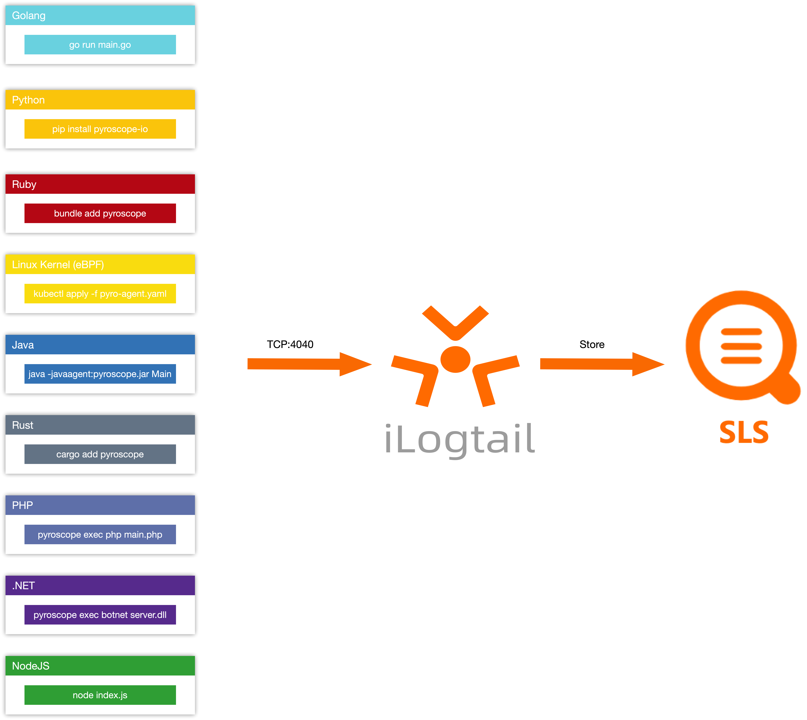

# Profile 集成

## Pyroscope 集成支持

注：本仓库大多Demo 来自于官方Pyroscope Demo，对相关 Demo 进行代码注释与接入阿里云日志服务必备参数补充补充。

1. [golang demo](pyroscope/golang/README.md)
2. [php demo](pyroscope/php/README.md)
3. [python demo](pyroscope/python/README.md)
4. [nodejs demo](pyroscope/nodejs/README.md)
5. [.NET demo](pyroscope/dotnet/README.md)
6. [ruby demo](pyroscope/ruby/README.md)
7. [rust demo](pyroscope/rust/README.md)
8. [java demo](pyroscope/java/README.md)
9. [javagent demo](pyroscope/javaagent/README.md)
10. [ebpf demo](pyroscope/ebpf/README.md)
